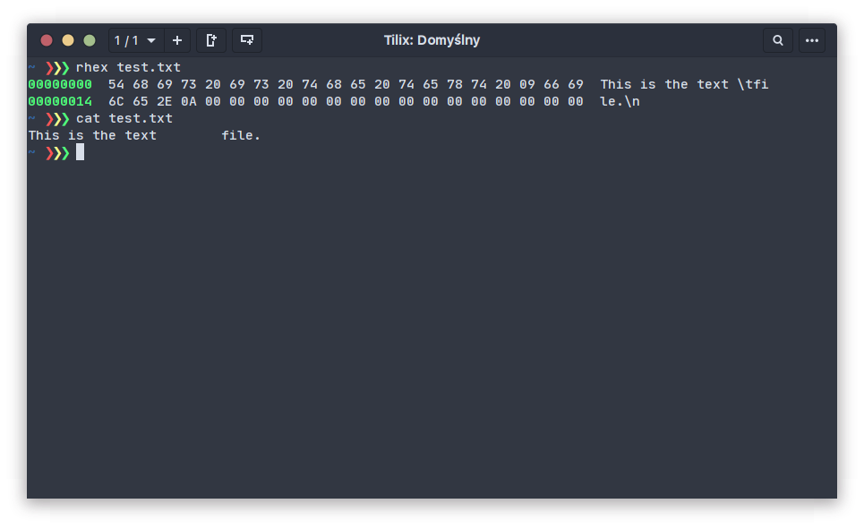
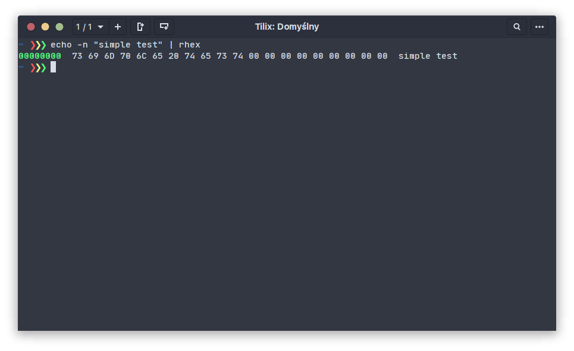
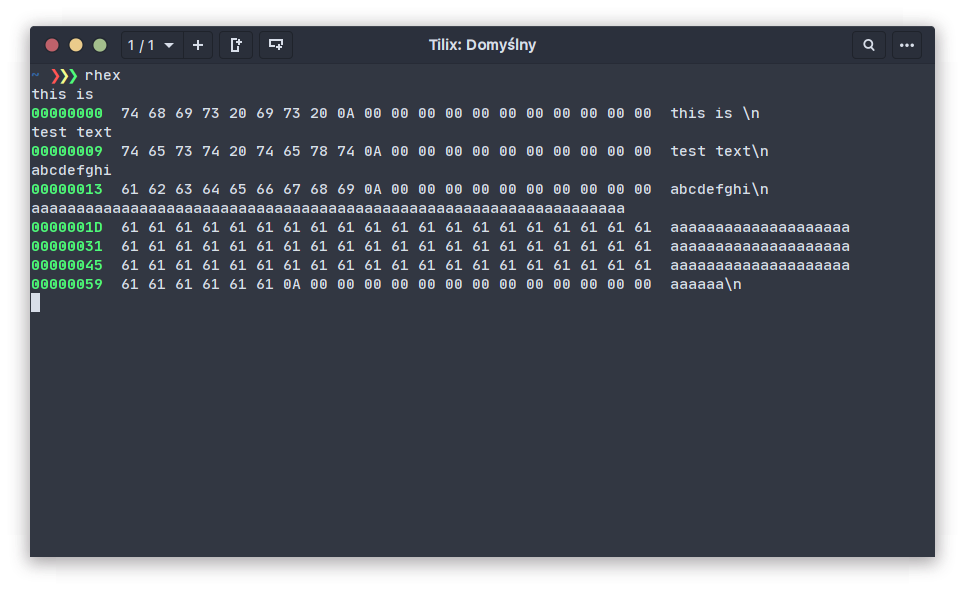
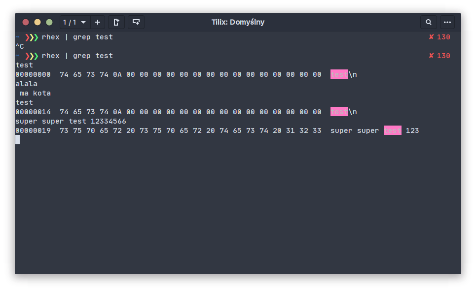
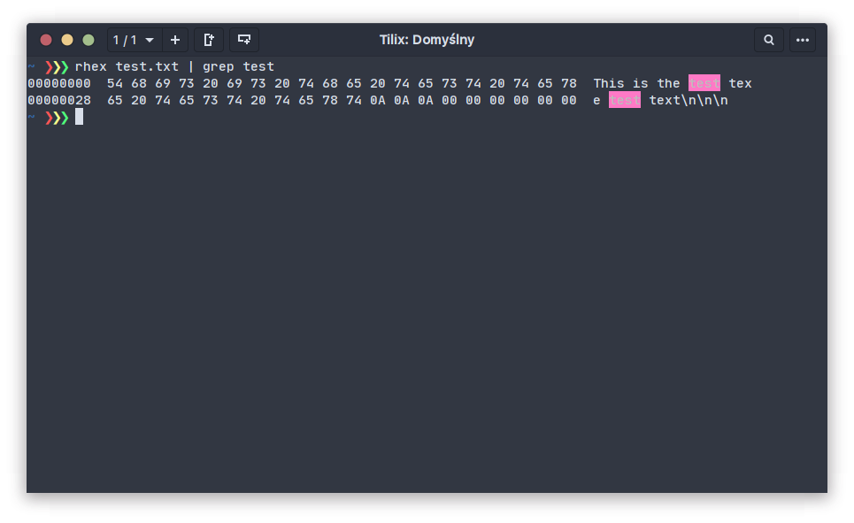
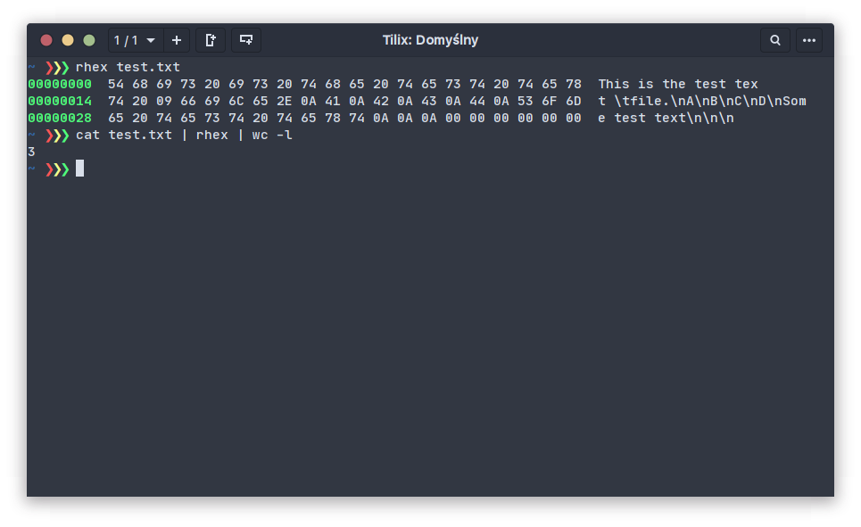
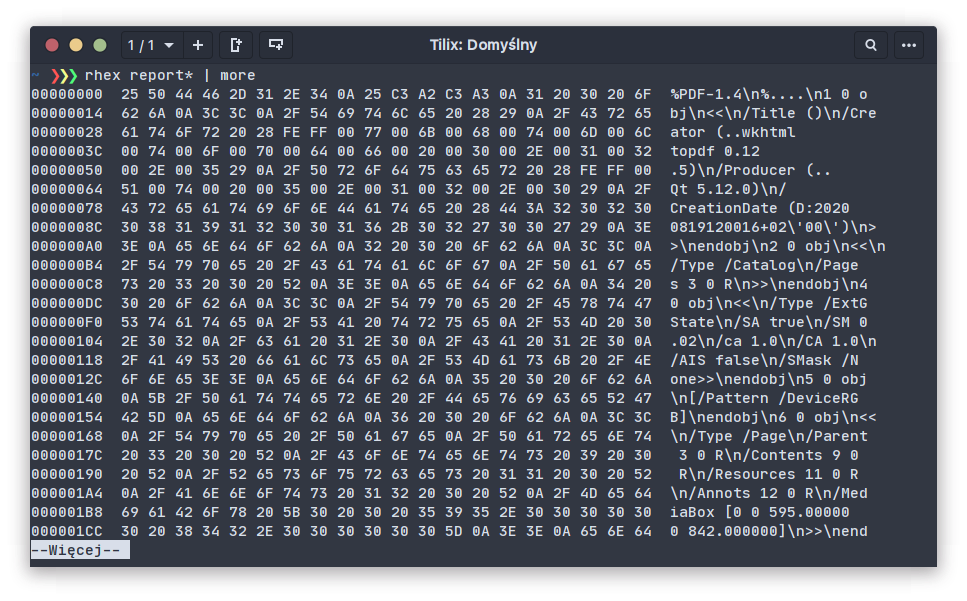
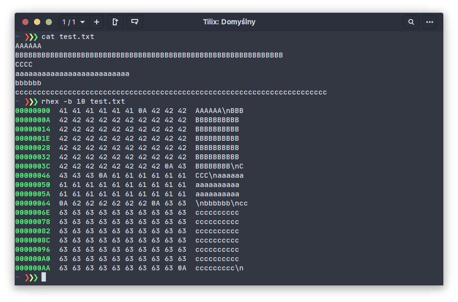

# rhex

Another command-line hex viewer

### Install

```
sudo wget https://github.com/wojciech-zurek/rhex/releases/download/v0.1.0/rhex -O /usr/local/bin/rhex
sudo chmod +x /usr/local/bin/rhex
```

### Build

```bash
    ./build.sh
```

### Cross build

```bash
    ./cross_build.sh
```

### Example usage

```bash
    rhex path/to/file
```



```bash
    command | rhex
```




```bash
    rhex
```



```bash
    rhex | grep # interactive grep
```




```bash
    rhex | command
```



```bash
    command | rhex | command
```



```bash
    rhex binary_file.pdf | command
```



```bash
    rhex -b 10 path/to/file # bytes per line
```


